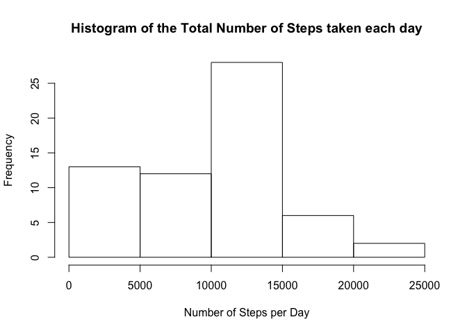
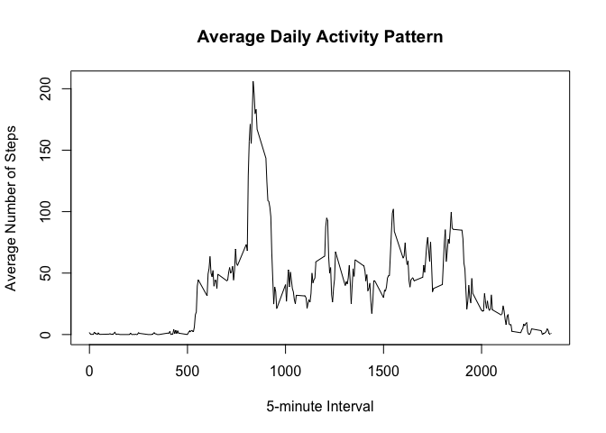
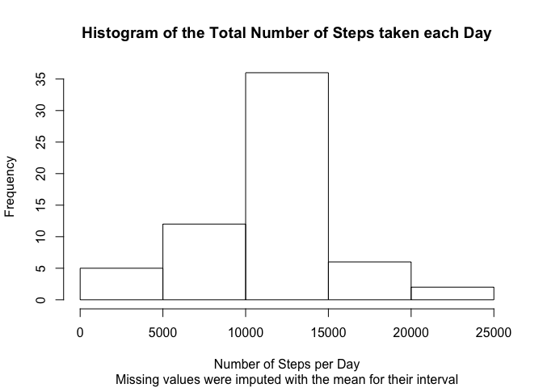
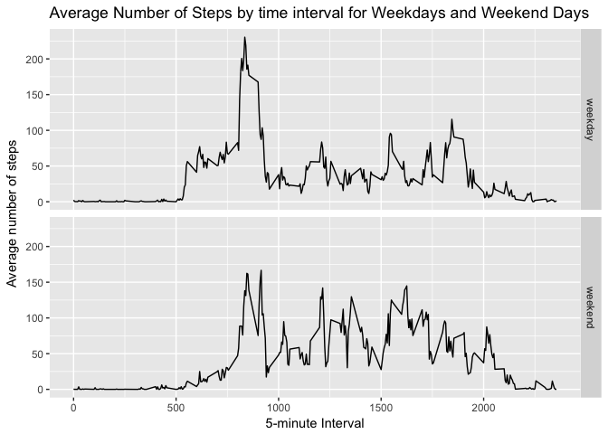

## Loading and preprocessing the data

First we unzip the "activity.zip" file:

```r
unzip("activity.zip")
```

That creates an "activity.csv" file that we can read using read.csv:

```r
activity <- read.csv("activity.csv")
```

Dates will be easier to handle if we convert them to Date type:

```r
activity$date <- as.Date(activity$date)
```


## What is mean total number of steps taken per day?

For this part of the assignment, we ignore the missing values in the dataset.  

We will use the library dplyr, so first, we load it.

```r
library(dplyr)
```

```
## 
## Attaching package: 'dplyr'
```

```
## The following objects are masked from 'package:stats':
## 
##     filter, lag
```

```
## The following objects are masked from 'package:base':
## 
##     intersect, setdiff, setequal, union
```

1. Calculate the total number of steps taken per day:

```r
grp <- group_by(activity, date)
total_nb_per_day <- summarise(grp, totalSteps = sum(steps, na.rm = TRUE))
```

2. Make a histogram of the total number of steps taken each day:

```r
hist(total_nb_per_day$totalSteps, 
     main = "Histogram of the Total Number of Steps taken each day",
     xlab = "Number of Steps per Day")
```

<!-- -->

3. Calculate the mean and median of the total number of steps taken per day:

```r
mean <- mean(total_nb_per_day$totalSteps)
median <- median(total_nb_per_day$totalSteps)
```

The mean of the total number of steps taken per day is **9354.2295082** steps per day.  
The median of the total number of steps taken per day is **10395** steps per day.  


## What is the average daily activity pattern?

1. Make a time series plot of the 5-minute interval (x-axis) and the average number of steps taken, averaged across all days (y-axis) :


```r
# calculate the values to display (average number of steps by time interval accross 
# all days)
grp <- group_by(activity, interval)
average_steps <- summarise(grp, averageSteps = mean(steps, na.rm = TRUE))

# plot
plot(average_steps, type = "l",
     main = "Average Daily Activity Pattern",
     xlab = "5-minute Interval",
     ylab = "Average Number of Steps")
```

<!-- -->

2. Which 5-minute interval, on average across all the days in the dataset, contains the maximum number of steps?

```r
max_step_idx <- which.max(average_steps$averageSteps)
avg <- average_steps [[max_step_idx, 1]]
```

The 5-minute interval which contains the maximum number of steps is **835**.


## Imputing missing values

1. Calculate the total number of missing values in the dataset:

```r
nas <- sum(is.na(activity$steps))
```

The total number of missing values in the dataset is **2304**.


2. Devise a strategy for filling in all of the missing values in the dataset:  

The missing values only occur in the steps column. And as there are entire days without values, for example, the first day, we think it best to populate the missing values with the mean for their corresponding 5-minute interval. We have already calculated these values in the last section.

3. Create a new dataset that is equal to the original dataset but with the missing data filled in:


```r
na_logical_idx <- is.na(activity$steps)
na_intervals <- activity$interval[na_logical_idx]

# new dataset filled_activity
filled_activity <- data.frame(activity)
filled_activity$steps[na_logical_idx] <- 
    average_steps[match(na_intervals, average_steps$interval),]$averageSteps
```


4. Make a histogram of the total number of steps taken each day:


```r
# calculate the values to display
grp <- group_by(filled_activity, date)
total_nb_per_day_filled <- summarise(grp, totalSteps = sum(steps))

# plot
hist(total_nb_per_day_filled$totalSteps, 
     main = "Histogram of the Total Number of Steps taken each Day",
     sub = "Missing values were imputed with the mean for their interval",
     xlab = "Number of Steps per Day")
```

<!-- -->

We also calculate the mean and median of the total number of steps taken per day:

```r
filled_mean <- mean(total_nb_per_day_filled$totalSteps)
filled_median <- median(total_nb_per_day_filled$totalSteps)
```


```r
filled_mean
```

```
## [1] 10766.19
```

```r
filled_median
```

```
## [1] 10766.19
```

The mean of the total number of steps taken per day is **1.0766189\times 10^{4}** steps per day.  
The median of the total number of steps taken per day is **1.0766189\times 10^{4}** steps per day.

The median is not an integer value, as we chose to fill the missing value with an average value, which were not integer.

Both mean and median values are larger than they were before imputting missing values. This is not surprising as they were previously implicitly replaced by 0, and they are now replaced by positive values.

The form of the histogram has also changed with lower frequency for small values (a lot of zeros, implicitly introduced disapeared), and a higher frequency elsewhere, especially for the already most frequent values. This is again not surprising considering our method of imputting missing values.


## Are there differences in activity patterns between weekdays and weekends?

1. Create a new factor variable in the dataset with two levels – “weekday” and “weekend” indicating whether a given date is a weekday or weekend day.

```r
# we define a function that returns the appropriate character for a date
weekendorweekday <- function(date) {
    if (weekdays(date) %in% c("Saturday", "Sunday")) 
        return("weekend")
    else
        return("weekday")
}

# adding "day" variable
filled_activity <- mutate(filled_activity, 
                          day = as.factor(sapply(date, weekendorweekday)))
```


2. Make a panel plot containing a time series plot (i.e. 𝚝𝚢𝚙𝚎 = "𝚕") of the 5-minute interval (x-axis) and the average number of steps taken, averaged across all weekday days or weekend days (y-axis).

```r
# loading ggplot2 package
library(ggplot2)

# calculating the values to display
grp <- group_by(filled_activity, interval, day)
activity_by_interval_and_day <- summarise(grp, averageSteps = mean(steps))

# panel plot using ggplot2
g5 <- qplot(interval, averageSteps, 
            data = activity_by_interval_and_day, 
            geom = "line")
g5 <- g5 + facet_grid(day~.)
g5 <- g5 + labs(x = "5-minute Interval",
                y = "Average number of steps",
                title = "Average Number of Steps by time interval for Weekdays and Weekend Days")

g5
```

<!-- -->

This plot shows that on weekends, the steps tend to be more equally distributed through the day, which is not surprising. There is also an early peak which occurs on weekdays and tend to be less important on weekends, an early jog or walk to the office perhaps.

